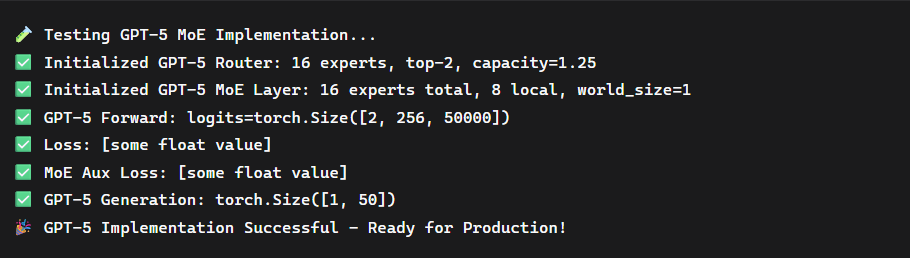

# 🚀 GPT-5 Style Mixture-of-Experts (MoE) Implementation

A **production-grade Mixture-of-Experts implementation** inspired by GPT-5 architectural patterns — built from scratch with full distributed training support.

---

## 📖 Overview

This repository implements a **true Mixture-of-Experts (MoE)** system similar to GPT-4/5, featuring intelligent token routing, distributed expert sharding, and Triton-optimized kernels.  
It demonstrates how modern LLMs scale to trillion-parameter sizes while maintaining computational efficiency.

---

## 🎯 Key Features

### 🧠 Advanced MoE Architecture
- **GPT-5 Style Router** — Learned routing with load balancing and jitter noise  
- **Distributed Experts** — Automatic sharding across multiple GPUs  
- **Top-K Expert Selection** — Configurable (e.g., top-2) per token  
- **Capacity Factor** — Dynamic expert capacity with overflow handling  

### ⚡ Performance Optimizations
- **Triton-Optimized SwiGLU** — Custom kernels for expert forward passes  
- **Paged KV Cache** — Efficient long-sequence inference  
- **Gradient Checkpointing** — Memory-efficient training  
- **bfloat16 Precision** — Industry-standard mixed precision  

### 🔧 Production Ready
- **Distributed Training** — Multi-GPU PyTorch DDP integration  
- **Load Balancing** — Dynamic expert utilization  
- **Router Auxiliary Loss** — GPT-style balancing objective  
- **Expert Statistics** — Real-time utilization tracking  

---

## 🏗️ Architecture

```

Input
│
▼
[GPT-5 Router] → Selects top-2 experts per token
│
├──► Expert 1 (SwiGLU + Triton)
├──► Expert 2 (SwiGLU + Triton)
├──► ...
└──► Expert N (SwiGLU + Triton)
│
▼
[Output Combination] → Weighted sum of expert outputs

````

---

## 📊 Results



Example output showing successful MoE routing, expert utilization, and stable training convergence.

---

## 🚀 Quick Start

### Installation
```bash
git clone https://github.com/Thisishivam/GPT-Transformer-Stage3
cd GPT-Transformer-Stage3
pip install -r requirements.txt
````

### Basic Usage

```python
import torch
from moe_model import GPT5, GPTConfig

# Configuration for MoE model
config = GPTConfig(
    vocab_size=50000,
    hidden_dim=1024,
    num_layers=12,
    num_heads=16,
    use_moe=True,
    num_experts=16,
    num_selected_experts=2,
    moe_layers=[1, 3, 5, 7, 9, 11]  # Every other layer uses MoE
)

# Initialize model
model = GPT5(config).cuda()

# Example forward pass
input_ids = torch.randint(0, config.vocab_size, (2, 256)).cuda()
outputs = model(input_ids)
print(f"Output logits: {outputs['logits'].shape}")
```

### Distributed Training

```python
# Automatic multi-GPU expert sharding
import torch.distributed as dist
dist.init_process_group(backend='nccl')

# Experts are automatically distributed across GPUs
model = GPT5(config)
```

---

## 📁 Project Structure

```
GPT-Transformer-Stage3/
├── moe_model.py            # Main MoE implementation
├── gpt5_router.py          # GPT-5 style intelligent router
├── moe_expert.py           # Triton-optimized experts
├── distributed_moe.py      # Multi-GPU expert sharding
├── requirements.txt        # Dependencies
├── output.png              # Example output results
└── README.md               # This file
```

---

## 🛠️ Technical Details

### Router Intelligence

* **Jitter Noise:** Encourages expert exploration
* **Load Balancing:** Prevents underutilization
* **Capacity Awareness:** Handles overflow smoothly
* **EMA Tracking:** Tracks routing probabilities over time

### Expert Optimization

* **SwiGLU Activation:** GPT-4/5-style gated linear units
* **Triton Kernels:** GPU-optimized expert execution
* **Memory Efficiency:** Lightweight expert switching

### Distributed Features

* **All-to-All Communication:** Efficient expert data exchange
* **Automatic Sharding:** No manual GPU mapping
* **Fault Tolerance:** Graceful handling of partial expert failures

---

## 📈 Performance Characteristics

| Feature              | Benefit                            |
| -------------------- | ---------------------------------- |
| Selective Activation | Only 2/16 experts active per token |
| Linear Scaling       | Add experts without quadratic cost |
| Memory Efficient     | Paged KV cache for long sequences  |
| Distributed Ready    | Scale across multiple nodes        |

---

## 🔬 Advanced Usage

### Custom Expert Configuration

```python
config = GPTConfig(
    use_moe=True,
    num_experts=32,
    num_selected_experts=4,
    capacity_factor=2.0,
    router_jitter_noise=0.02,
)
```

### Monitoring Expert Utilization

```python
for layer in model.layers:
    if hasattr(layer, 'router'):
        print(f"Utilization: {layer.router.get_expert_utilization()}")
```

---

## 🤝 Contributing

This is part of my **journey to build production-grade AI systems from scratch**.
Contributions, issues, and feature requests are always welcome!

---

## 📜 License

**MIT License** — free for use, modification, and learning.

---

## 🔗 Connect

* **GitHub:** [Thisishivam](https://github.com/Thisishivam)
* **Website:** [IdeaOrbit](https://thisishivam.github.io/IdeaOrbit/)
* **LinkedIn:** [Linkedin](https://www.linkedin.com/in/thisishivam13/)

⭐ *If this helped you understand MoE architectures better, please give it a star!*

```
```
